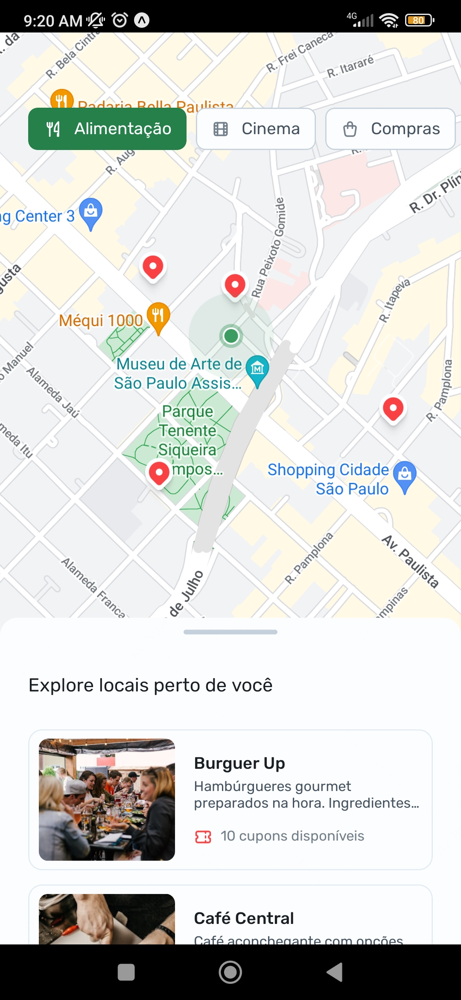
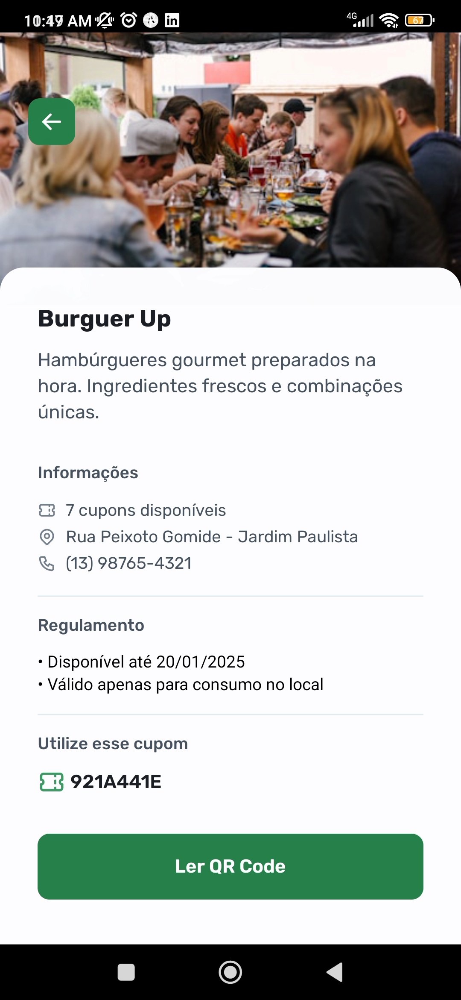
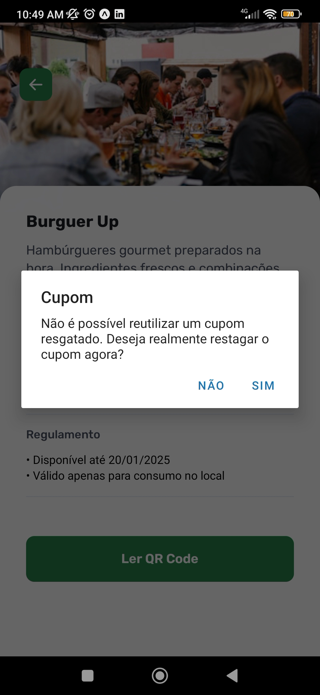

# Nearby - Mobile Application

👨🏽‍💻 This app was developed with nlw mobile from RocketSeat.

- React Native
- TypeScript
- API
- Expo
- Axios

## Summary

- [Images](#images);
- [Dependencies](#dependencies);
- [DevDependencies](#devdependencies);
- [Objectives](#objectives);
- [Functionalities](#functionalities);
- [Author](#author);

## Images

    

        <h3>Map</h3>
        
    

    

        <h3>Markets list</h3>
        
    

    

        <h3>Market details</h3>
        
    

    

        <h3>Using camera</h3>
        
    

    

        <h3>Validations</h3>
        
    

## Dependencies

- [react-native-maps](https://docs.expo.dev/versions/latest/sdk/map-view/): A library that provides a Map component that uses Google Maps on Android and Apple Maps or Google Maps on iOS.

- [@gorhom/bottom-sheet](https://github.com/gorhom/react-native-bottom-sheet): A performant interactive bottom sheet with fully configurable options for React Native

- [@tabler/icons-react-native](https://tabler.io/docs/icons/react-native): Tabler is a free and open source web application UI kit based on Bootstrap 5, with hundreds responsive components, icons and multiple layouts.

- [axios](https://axios-http.com/ptbr/): Axios is a simple promise-based HTTP client for the browser and node.js. Axios provides a simple to use library in a small package with a great interface.

- [react-native-maps](https://docs.expo.dev/versions/latest/sdk/map-view/): A library that provides a Map component that uses Google Maps on Android and Apple Maps or Google Maps on iOS.

- [expo-camera](https://docs.expo.dev/versions/latest/sdk/camera/): A React component that renders a preview for the device's front or back camera.

## DevDependencies

- [eslint-plugin-expo](https://docs.expo.dev/guides/using-eslint/): A guide on configuring ESLint and Prettier to format Expo apps.

## Objectives

- To create an app that can render close places with discounts.
- To be possible to visualize them into the map.
- To verify the location details.
- To scan a QR Code to receive a discount coupon using the phone camera.
- To filter locations by categories.

## Functionalities

To run the project, download the zip from the link below, run the server to make your API available to be used in our application.

- [Download the code of the API](https://drive.google.com/drive/folders/1rAX-GQa2na_gMjgnsWQqNpHKwCKQug2_).
- Install the dependencies using `npm install`.
- Create the prisma migrations with `npx prisma migrate dev`.
- Execute the server with `npm run start` or check the scripts into package.json.

Running the React Native project:

- Install the dependencies with `npm install` or `pnpm install`.
- Execute the project with `npx expo start`
- To use your own cellphone or ios/android emulators, please, verify the documentation to know how to configure the expo correctly. [Click here](https://docs.expo.dev/get-started/set-up-your-environment/)

## Author

- GitHub - [Felipe Santiago Morais](https://github.com/SantiagoMorais)
- Linkedin - [Felipe Santiago](https://www.linkedin.com/in/felipe-santiago-873025288/)
- Instagram - [@felipe.santiago.morais](https://www.instagram.com/felipe.santiago.morais)
- Email - <a href="mailto:contatofelipesantiago@gmail.com" target="blank">contatofelipesantiago@gmail.com</a>
- <a href="https://api.whatsapp.com/send?phone=5531996951033&text=Hi%2C%20Felipe%21%20I%20got%20your%20contact%20from%20your%20portfolio.">Whatsapp</a>
